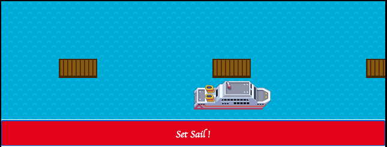

<h1> Javascript Cruise Ships </h1>

A project that simulates cruise ships sailing and docking from port to port, with an interactive GUI which also displays these actions. The project utilises many of the core concepts of Object-Oriented Programming.

<h1> Running this project </h1>

 If you would like to run this project, ensure you have Node.js installed on your machine, and then fork the repo to your local machine.

Now run node.js inside the repo to install the project dependencies, including Jest which will allow you to run and write tests for the project. If you would like to run the project's GUI, simply open the file index.html inside your browser

Alternatively, if you would like to view the GUI through github pages you can do so at https://scott-hannabuss.github.io/cruise-ships-/

<h1> Project Features </h1>

 There are three object constructors within the project; ships, ports and itineraries. Ships can store port and itinerary objects as nested objects. Ports will store records of the ships that are docked at them, and itineraries will list the current, future and previous ports that the ship is going to travel to.

The GUI has a changing sea animation background, to make it appear as if the waves are moving. By clicking on the sail button, users can sail to the next port, and the display in the top-right corner of the GUI will inform users where they are sailing to next. 

<h1> Technologies </h1>

 The project utilised several technologies including Javascript, Jest and Node. 

<h1> Project Status </h1>

This project has been completed.

<h1> Authors </h1>

Scott Hannabuss

<h1>Acknowledgements</h1>

Manchester codes, the bootcamp who designed the project

